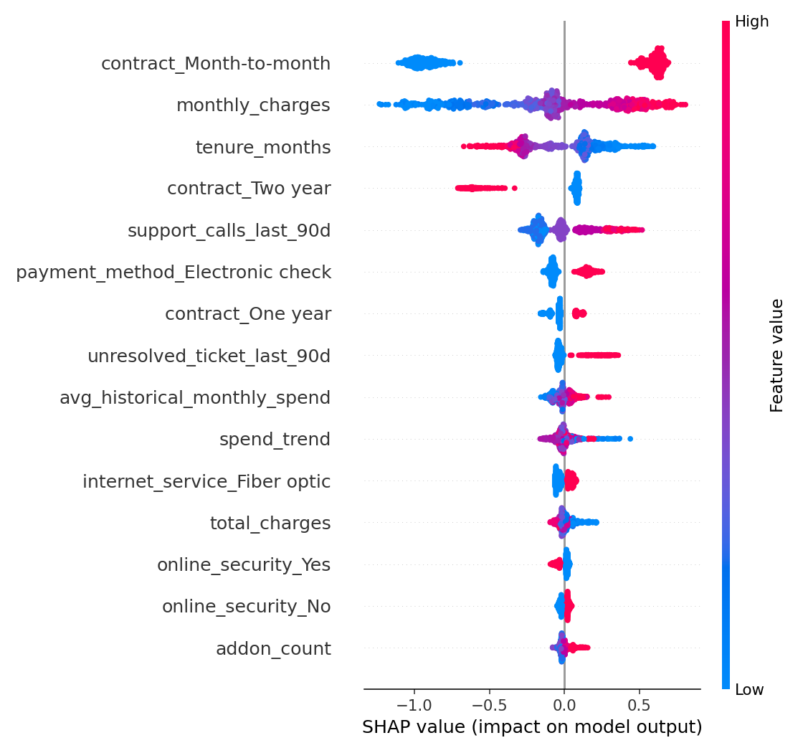

# Customer Churn Risk System

A subscription business's customer table, turned into a served, explainable churn-risk model. Every
stage is a small, plain module — no notebook required to understand or run any of it.

```
customers.csv --> DuckDB (SQL feature view) --> XGBoost (search + early stopping)
                                                       |
                                                       v
                               SHAP explainability <-- churn_model.json
                                                       |
                                                       v
                                          FastAPI  /predict  /model/info  /segments
```

## Why this exists

Churn prediction is one of the most common "first ML project" ideas, and most implementations stop at
a Jupyter notebook that ends with `model.score(X_test)`. This one goes further on purpose, into the
parts that actually matter once a model needs to run for someone other than its author:

- **A real feature-parity problem, and a real fix for it.** The engineered features (`tenure_bucket`,
  `avg_historical_monthly_spend`, `spend_trend`, `is_high_support_volume`) are defined once, in SQL
  (`sql/schema.sql`), and reused unchanged by both the training path (`DuckDB` file query) and the
  serving path (`DuckDB` in-memory query against a single API request). `tests/test_database.py`
  asserts the two paths produce byte-identical output — this test caught a real bug during development
  (DuckDB infers `Yes`/`No` CSV columns as `BOOLEAN` on disk but keeps them as text in memory, which
  silently produced two different one-hot column names for the same field) and is what stops that class
  of training/serving skew from coming back.
- **A held-out test set the hyperparameter search never sees.** `train.py` splits train/validation/test
  up front, early-stops each trial on validation AUC, and only evaluates the winning configuration once,
  on test. The reported numbers below are that one, honest evaluation.
- **Explanations, not just a probability.** Every `/predict` response includes the top-3 SHAP
  contributors for that specific customer, not just a global feature-importance chart.
- **A believable model, not a leaky one.** The synthetic dataset (see below) bakes in irreducible label
  noise on purpose. A churn model claiming 0.99 AUC on any dataset — synthetic or real — almost always
  means the label leaked into a feature. `tests/test_train.py::test_test_set_auc_is_believable_not_suspicious`
  pins this down explicitly.

## The data

Real customer data can't ship in a public repo, so `data/generate_data.py` generates a statistically
realistic stand-in: ~7,000 customers with the same *shape* of signal a real subscription business has
(contract type and tenure dominate; price sensitivity and support-call volume matter; demographics
barely matter), built from a hazard model with random noise layered on top, at a **28.9% churn rate** —
in line with the well-known public IBM Telco Churn benchmark (26.5%), not a suspiciously round number.

```bash
python data/generate_data.py --rows 7000        # -> data/raw/customers.csv
```

## Results

Trained with a 20-trial randomized hyperparameter search (`sql/schema.sql` -> `features.py` ->
`train.py`), early-stopped on a validation split, evaluated once on a held-out test set (1,050 customers,
never touched during search):

| Metric | Test set |
|---|---|
| ROC AUC | **0.785** |
| PR AUC | 0.557 |
| Precision @ 0.5 | 0.607 |
| Recall @ 0.5 | 0.382 |
| F1 @ 0.5 | 0.469 |
| Brier score | 0.164 |

Recall at the default 0.5 threshold is intentionally modest — precision/recall trade off, and the
right operating point depends on what a retention team can act on (see `/segments` for a cheaper,
model-free triage view). `reports/metrics.json` has the full report, including every search trial.

**Top drivers (mean |SHAP value|, 800-customer sample):**



Contract type dominates by a wide margin, followed by monthly charges and tenure — which lines up with
both retention-industry intuition and how the synthetic hazard model was actually built, which is the
sanity check that matters most for a project like this.

## Run it

```bash
pip install -r requirements-dev.txt

python data/generate_data.py --rows 7000        # 1. synthetic data
PYTHONPATH=src python -m churn_system.train      # 2. SQL features -> search -> train -> held-out eval
PYTHONPATH=src python -m churn_system.explain    # 3. SHAP report (reports/shap_summary.png + .csv)
PYTHONPATH=src uvicorn churn_system.api:app --reload   # 4. serve
```

or, with `make`:

```bash
make install && make all && make serve
```

### API

```bash
curl -s localhost:8000/predict -X POST -H 'content-type: application/json' -d '{
  "customers": [{
    "customer_id": "CUS-100123", "tenure_months": 2, "contract": "Month-to-month",
    "internet_service": "Fiber optic", "payment_method": "Electronic check",
    "paperless_billing": "Yes", "tech_support": "No", "online_security": "No",
    "senior_citizen": 0, "partner": "No", "dependents": "No",
    "monthly_charges": 95.5, "total_charges": 191.0, "addon_count": 3,
    "support_calls_last_90d": 4, "unresolved_ticket_last_90d": 1
  }]
}' | python3 -m json.tool
```

```json
{
  "predictions": [{
    "customer_id": "CUS-100123",
    "churn_probability": 0.7095,
    "risk_tier": "high",
    "top_risk_factors": ["contract_Month-to-month (+0.48)", "monthly_charges (+0.29)", "tenure_months (+0.24)"]
  }],
  "model_version": "churn_model"
}
```

Interactive docs at `localhost:8000/docs` (FastAPI's auto-generated Swagger UI). Other endpoints:
`GET /health`, `GET /model/info`, `GET /segments/{column}` (e.g. `/segments/contract`) for a DuckDB-only,
model-free churn-rate breakdown by segment.

### Docker

```bash
docker build -t churn-system .
docker run -p 8000:8000 churn-system
```

The image trains the model during build, so `docker run` alone is a working, served model — no volume
mount or separate training step required.

## Project layout

```
data/generate_data.py          synthetic dataset generator
sql/schema.sql                 the one definition of every engineered feature (SQL)
src/churn_system/
  config.py                    every path + hyperparameter, in one place, env-var overridable
  database.py                  DuckDB warehouse build + the shared in-memory feature path
  features.py                  one-hot encoding, with a saved column manifest for train/serve parity
  train.py                     split -> randomized search -> refit -> held-out evaluation
  explain.py                   SHAP summary plot + per-feature importance CSV
  predict.py                   batch inference + per-prediction SHAP explanation
  api.py                       FastAPI app
  schemas.py                   pydantic request/response models
tests/                         29 tests: data generation, SQL/pandas feature parity, training,
                                explainability, and the API (see `pytest -v`)
reports/                       metrics.json (full search + eval report), SHAP outputs
models/                        churn_model.json (XGBoost, native format) + feature_manifest.json
.github/workflows/ci.yml       lint + test + a small end-to-end train/explain smoke run, on every push
```

## Tests

```bash
pytest -v                                  # 29 tests
pytest --cov=churn_system --cov-report=term-missing   # 88% line coverage
ruff check .                               # clean
```

## What I'd do next with real production data

- Replace the fixed 0.5 decision threshold with one chosen against an actual retention-offer cost curve
  (an unnecessary discount and a missed at-risk customer don't cost the same).
- Add a monitoring job comparing the live feature distribution against the training distribution
  (population stability index per feature) to catch drift before the model quietly gets worse.
- Swap the CSV/DuckDB-file source for a real warehouse connection (Snowflake/BigQuery) behind the same
  `database.py` interface — nothing downstream would need to change.
